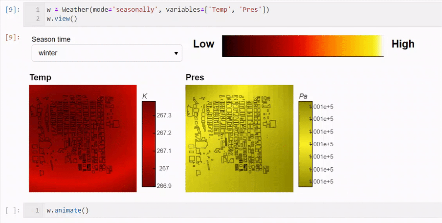

**Primary developers**: Brian Lerner, Casey Christian

## Weather Viz

Weather Viz is a tool created in order to analyze the weather data for Challenge 3 of the 2020 SMC Data Challenge.

The tool is set up to view changing weather data for the given parameters.
Individual times can be selected, or they can be run in an animation.
Currently, the data can be processed by day...

or by season...

